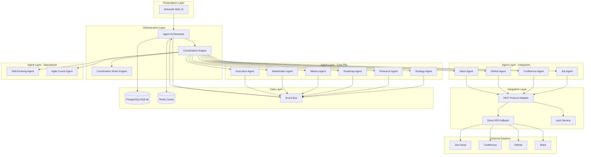

# ADR-001: High Level Solution Architecture

## Status
Accepted

## Context
FuturisticPM is an enterprise-grade AI-powered product management platform serving very large organizations (10,000+ users) with complex multi-agent workflows. The system must handle:
- 10+ specialized AI agents working in coordination
- Integration with multiple external systems (Jira, Confluence, GitHub, Slack)
- High concurrency (1000+ concurrent users)
- Strict security and compliance requirements
- 99.9% uptime SLA
- Sub-second response times for agent interactions
- Complete audit trails and versioning

## Problem Statement
Design a scalable, maintainable, and secure architecture that supports:
1. Multi-agent orchestration with complex workflows
2. Integration with enterprise tools via MCP (Model Context Protocol)
3. Stateful workflows with persistence
4. Real-time user interactions via web UI
5. Horizontal scalability
6. Fault tolerance and resilience

## Decision
Adopt a **layered microservices architecture** with:
- **Presentation Layer**: Streamlit web application
- **Orchestration Layer**: Agent Orchestrator service
- **Agent Layer**: Specialized agent services (Core PM, Integration, Specialized)
- **Integration Layer**: MCP protocol adapters and direct API fallbacks
- **Data Layer**: SQLite (development) / PostgreSQL (production) with versioning
- **Communication**: Async message passing via event bus (Redis Streams/RabbitMQ)

## Architecture Diagram

## Solution Options

### Option 1: Monolithic Architecture
**Pros:**
- Simple deployment
- Easier development initially
- Single codebase

**Cons:**
- Poor scalability
- Single point of failure
- Difficult to scale individual components
- Not suitable for enterprise scale

### Option 2: Microservices Architecture (Selected)
**Pros:**
- Independent scaling of agents
- Fault isolation
- Technology diversity
- Team autonomy
- Better resource utilization

**Cons:**
- Increased complexity
- Network latency
- Distributed system challenges
- Requires service mesh

### Option 3: Serverless Architecture
**Pros:**
- Auto-scaling
- Pay-per-use
- No infrastructure management

**Cons:**
- Cold start latency
- Vendor lock-in
- Limited state management
- Cost at scale

## Functional Requirements
- **FR-1**: Support 10+ specialized agents with distinct capabilities
- **FR-2**: Enable sequential and parallel agent execution
- **FR-3**: Maintain workflow state across sessions
- **FR-4**: Integrate with Jira, Confluence, GitHub, Slack
- **FR-5**: Support MCP protocol and direct API fallbacks
- **FR-6**: Provide web-based UI for user interactions

## Non-Functional Requirements
- **NFR-1**: Support 1000+ concurrent users
- **NFR-2**: 99.9% uptime availability
- **NFR-3**: Sub-second response for agent interactions
- **NFR-4**: Complete audit logging
- **NFR-5**: Horizontal scalability
- **NFR-6**: Fault tolerance with automatic recovery
- **NFR-7**: End-to-end encryption for sensitive data
- **NFR-8**: Compliance with SOC 2, GDPR, HIPAA

## Consequences

### Positive
- Scalable architecture supporting enterprise growth
- Independent agent deployment and updates
- Better fault isolation
- Technology flexibility per agent
- Clear separation of concerns

### Negative
- Increased operational complexity
- Need for service mesh (Istio/Linkerd)
- Distributed tracing required
- More complex debugging
- Higher infrastructure costs

## Implementation Notes
- Use Kubernetes for container orchestration
- Implement service mesh for inter-service communication
- Use Redis Streams for event-driven communication
- PostgreSQL for production data persistence
- Implement circuit breakers for external integrations
- Use distributed tracing (Jaeger/Zipkin)

