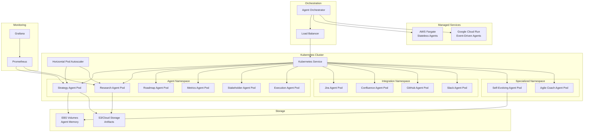

# ADR-002: Best Platform for Agent Hosting

## Status
Accepted

## Context
FuturisticPM requires hosting 10+ AI agents that:
- Process LLM requests (OpenAI GPT-4o)
- Maintain conversation state and memory
- Handle MCP protocol connections
- Scale independently based on workload
- Require low-latency responses (<1s)
- Need persistent storage for agent memory
- Must support enterprise security requirements

## Problem Statement
Select the optimal hosting platform for AI agents in a large enterprise environment that balances:
- Cost efficiency
- Scalability
- Performance
- Security compliance
- Operational simplicity
- Vendor lock-in risk

## Decision
Adopt a **hybrid hosting strategy**:
- **Primary**: Kubernetes (EKS/GKE/AKS) for agent services
- **Secondary**: Managed container services (AWS Fargate, Google Cloud Run) for stateless agents
- **Specialized**: Dedicated GPU instances for compute-intensive agents (if needed)

## Architecture Diagram



## Solution Options

### Option 1: Kubernetes (EKS/GKE/AKS) - Selected
**Pros:**
- Industry standard for container orchestration
- Excellent auto-scaling (HPA/VPA)
- Rich ecosystem (Istio, Prometheus, etc.)
- Multi-cloud portability
- Fine-grained resource control
- Enterprise security features (RBAC, network policies)
- Cost-effective at scale

**Cons:**
- Steeper learning curve
- Requires Kubernetes expertise
- Infrastructure management overhead

**Best For:**
- Core PM agents (stateful, high traffic)
- Integration agents (MCP connections)
- Long-running specialized agents

### Option 2: Serverless (AWS Lambda, Azure Functions)
**Pros:**
- Zero infrastructure management
- Automatic scaling
- Pay-per-invocation
- Built-in high availability

**Cons:**
- Cold start latency (2-5s)
- 15-minute execution limit
- Difficult state management
- Vendor lock-in
- Higher cost at scale

**Best For:**
- Event-driven agents
- Low-frequency operations

### Option 3: Managed Containers (AWS Fargate, Google Cloud Run)
**Pros:**
- No cluster management
- Automatic scaling
- Pay-per-use
- Faster than serverless

**Cons:**
- Less control than Kubernetes
- Higher cost than self-managed
- Limited customization

**Best For:**
- Stateless agents
- Burst workloads

### Option 4: Virtual Machines (EC2, GCE, Azure VM)
**Pros:**
- Full control
- Predictable performance
- Cost-effective for steady workloads

**Cons:**
- Manual scaling
- Infrastructure overhead
- Slower deployment
- Not cloud-native

**Best For:**
- Legacy systems
- Specialized hardware requirements

## Functional Requirements
- **FR-1**: Host 10+ agent services independently
- **FR-2**: Support auto-scaling based on CPU/memory/custom metrics
- **FR-3**: Maintain agent state and memory across restarts
- **FR-4**: Support MCP protocol connections
- **FR-5**: Enable zero-downtime deployments
- **FR-6**: Support health checks and automatic recovery

## Non-Functional Requirements
- **NFR-1**: Sub-second agent response times
- **NFR-2**: 99.9% availability SLA
- **NFR-3**: Support 1000+ concurrent agent instances
- **NFR-4**: Cost-effective scaling (pay for what you use)
- **NFR-5**: Multi-region deployment capability
- **NFR-6**: Compliance with enterprise security standards
- **NFR-7**: Complete observability (metrics, logs, traces)

## Recommended Platform Configuration

### Kubernetes Configuration
```yaml
# Agent Deployment Example
apiVersion: apps/v1
kind: Deployment
metadata:
  name: strategy-agent
spec:
  replicas: 3
  template:
    spec:
      containers:
      - name: agent
        image: futuristic-pm/strategy-agent:latest
        resources:
          requests:
            memory: "512Mi"
            cpu: "250m"
          limits:
            memory: "2Gi"
            cpu: "1000m"
---
apiVersion: autoscaling/v2
kind: HorizontalPodAutoscaler
metadata:
  name: strategy-agent-hpa
spec:
  scaleTargetRef:
    apiVersion: apps/v1
    kind: Deployment
    name: strategy-agent
  minReplicas: 2
  maxReplicas: 20
  metrics:
  - type: Resource
    resource:
      name: cpu
      target:
        type: Utilization
        averageUtilization: 70
```

### Resource Allocation
- **Core PM Agents**: 2-4 CPU, 2-4GB RAM, 3-5 replicas
- **Integration Agents**: 1-2 CPU, 1-2GB RAM, 2-3 replicas
- **Specialized Agents**: 2-4 CPU, 4-8GB RAM, 2-3 replicas

## Consequences

### Positive
- Industry-standard, battle-tested platform
- Excellent scalability and reliability
- Multi-cloud portability reduces vendor lock-in
- Rich ecosystem for monitoring, security, networking
- Cost-effective at enterprise scale

### Negative
- Requires Kubernetes expertise
- Initial setup complexity
- Ongoing cluster management
- Need for additional tooling (service mesh, monitoring)

## Implementation Notes
- Use managed Kubernetes (EKS/GKE/AKS) for production
- Implement HPA based on custom metrics (request rate, queue depth)
- Use persistent volumes for agent memory storage
- Implement pod disruption budgets for high availability
- Use cluster autoscaler for node-level scaling
- Implement resource quotas per namespace
- Use network policies for security isolation

