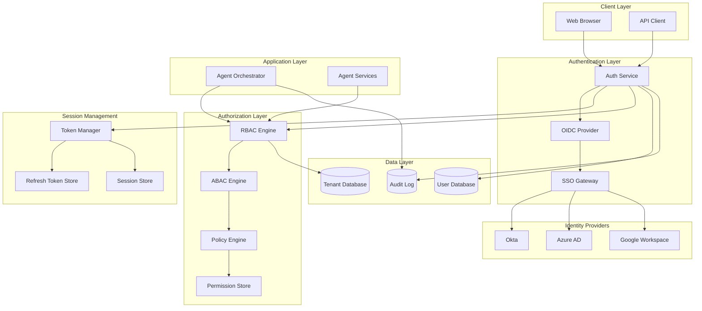
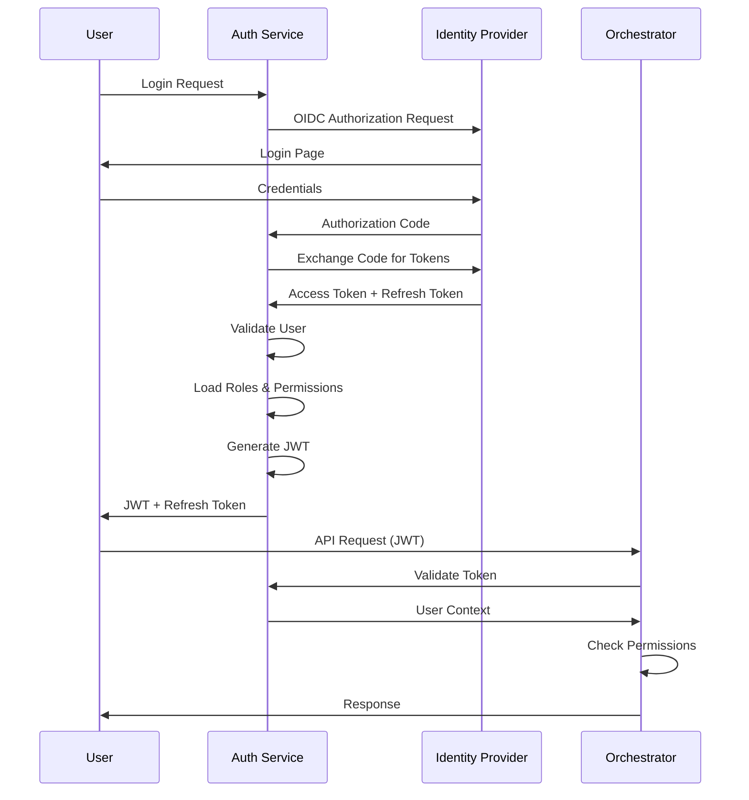

# ADR-003: User Authentication and Authorization

## Status
Accepted

## Context
FuturisticPM serves large enterprises (10,000+ users) with strict security requirements:
- Multiple identity providers (Okta, Azure AD, Google Workspace)
- Role-based access control (RBAC)
- Multi-tenant isolation
- Audit logging for compliance (SOC 2, GDPR)
- Session management
- API token management for integrations
- OAuth 2.0 / OIDC support

## Problem Statement
Design a secure authentication and authorization system that:
1. Integrates with enterprise identity providers
2. Enforces fine-grained access control
3. Supports multi-tenancy
4. Provides audit trails
5. Manages API tokens for agent integrations
6. Handles OAuth flows for external services (Jira, Confluence)

## Decision
Implement **OAuth 2.0 / OIDC-based authentication** with:
- **Identity Provider**: Enterprise SSO (Okta, Azure AD, Google Workspace)
- **Authorization**: RBAC with attribute-based access control (ABAC)
- **Session Management**: JWT tokens with refresh tokens
- **API Security**: API keys with scoped permissions
- **Multi-tenancy**: Tenant isolation at data and application layer

## Architecture Diagram



## Solution Options

### Option 1: OAuth 2.0 / OIDC with Enterprise SSO (Selected)
**Pros:**
- Industry standard
- Supports multiple identity providers
- Single Sign-On (SSO) experience
- Token-based (stateless)
- Refresh token support
- Widely supported by enterprise tools

**Cons:**
- Complex initial setup
- Requires identity provider configuration
- Token management complexity

### Option 2: SAML 2.0
**Pros:**
- Enterprise standard
- Strong security
- XML-based assertions

**Cons:**
- Less flexible than OAuth
- XML complexity
- Limited modern API support
- No refresh tokens

### Option 3: Custom Authentication
**Pros:**
- Full control
- Custom requirements

**Cons:**
- Security risks
- Maintenance burden
- Not enterprise-ready
- Compliance challenges

## Functional Requirements
- **FR-1**: Support SSO via Okta, Azure AD, Google Workspace
- **FR-2**: Role-based access control (Admin, PM, Viewer, Guest)
- **FR-3**: Tenant isolation (multi-tenant support)
- **FR-4**: API key management for integrations
- **FR-5**: OAuth 2.0 flows for external services
- **FR-6**: Session management with refresh tokens
- **FR-7**: Password reset and MFA support

## Non-Functional Requirements
- **NFR-1**: Zero-trust security model
- **NFR-2**: End-to-end encryption (TLS 1.3)
- **NFR-3**: Token expiration (15 min access, 7 day refresh)
- **NFR-4**: Complete audit logging
- **NFR-5**: SOC 2 Type II compliance
- **NFR-6**: GDPR compliance (right to deletion)
- **NFR-7**: Rate limiting (prevent brute force)
- **NFR-8**: Session timeout (8 hours inactivity)

## Role Definitions

### Roles
1. **Super Admin**
   - Full system access
   - User management
   - System configuration

2. **Tenant Admin**
   - Full access within tenant
   - User management within tenant
   - Integration configuration

3. **Product Manager**
   - Create/edit product plans
   - Execute workflows
   - Publish to Jira/Confluence
   - View all plans in tenant

4. **Team Member**
   - View assigned plans
   - Comment on plans
   - Limited edit permissions

5. **Viewer**
   - Read-only access
   - View published plans

6. **Guest**
   - Limited trial access
   - No publishing permissions

## Permission Matrix

| Resource | Super Admin | Tenant Admin | PM | Team Member | Viewer | Guest |
|----------|-------------|--------------|----|----|----|----|
| Create Plan | ✅ | ✅ | ✅ | ❌ | ❌ | ❌ |
| Edit Plan | ✅ | ✅ | ✅ | ⚠️ | ❌ | ❌ |
| Delete Plan | ✅ | ✅ | ✅ | ❌ | ❌ | ❌ |
| Publish to Jira | ✅ | ✅ | ✅ | ❌ | ❌ | ❌ |
| Publish to Confluence | ✅ | ✅ | ✅ | ❌ | ❌ | ❌ |
| View Plans | ✅ | ✅ | ✅ | ⚠️ | ✅ | ⚠️ |
| Manage Users | ✅ | ⚠️ | ❌ | ❌ | ❌ | ❌ |
| Configure Integrations | ✅ | ✅ | ⚠️ | ❌ | ❌ | ❌ |

## Implementation Details

### Authentication Flow


### Token Structure
```json
{
  "access_token": "eyJhbGciOiJSUzI1NiIs...",
  "token_type": "Bearer",
  "expires_in": 900,
  "refresh_token": "eyJhbGciOiJSUzI1NiIs...",
  "scope": "read write admin"
}
```

### JWT Claims
```json
{
  "sub": "user-123",
  "email": "user@company.com",
  "tenant_id": "tenant-456",
  "roles": ["product_manager"],
  "permissions": ["plans:create", "plans:edit", "jira:publish"],
  "iat": 1234567890,
  "exp": 1234571490
}
```

## Consequences

### Positive
- Industry-standard security
- SSO improves user experience
- Flexible role and permission model
- Multi-tenant isolation
- Compliance-ready (SOC 2, GDPR)
- Scalable token-based architecture

### Negative
- Complex initial setup
- Requires identity provider configuration
- Token management overhead
- Need for token refresh logic
- Potential vendor lock-in to identity provider

## Implementation Notes
- Use **Auth0**, **Okta**, or **AWS Cognito** for managed identity
- Implement **Ory Hydra** or **Keycloak** for self-hosted option
- Use **Redis** for session and token storage
- Implement **rate limiting** (100 req/min per user)
- Use **JWT** with RS256 algorithm
- Implement **CORS** policies
- Use **HTTP-only cookies** for refresh tokens
- Implement **CSRF protection**
- Store audit logs in **immutable storage** (S3 with versioning)

