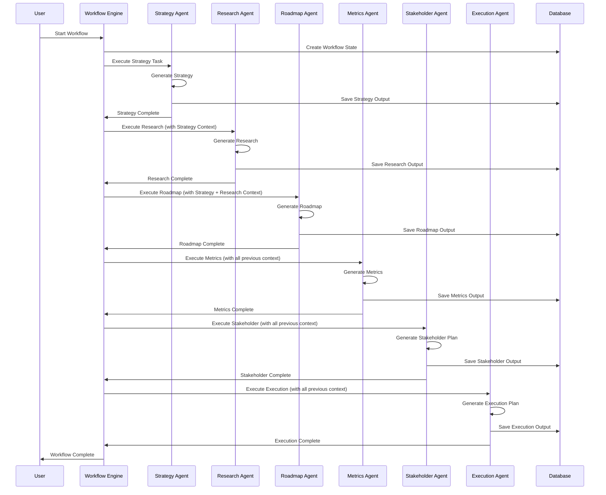

# ADR-004: Architecture Pattern for Core PM Agents

## Status
Accepted

## Context
FuturisticPM has 6 core Product Management agents:
1. **Strategy Agent**: Product vision, market positioning
2. **Research Agent**: User research, competitive analysis
3. **Roadmap Agent**: Feature prioritization, release planning
4. **Metrics Agent**: KPIs, success metrics
5. **Stakeholder Agent**: Communication plans, alignment
6. **Execution Agent**: Sprint planning, agile frameworks

These agents:
- Execute sequentially in workflow
- Require context from previous agents
- Generate structured outputs
- Need state persistence
- Must handle errors gracefully

## Problem Statement
Design architecture pattern for core PM agents that:
1. Supports sequential workflow execution
2. Enables context passing between agents
3. Provides structured output generation
4. Handles state persistence
5. Supports error recovery and retries
6. Enables independent scaling

## Decision
Adopt **Stateful Agent Pattern** with:
- **Agent Service**: Stateless service with LLM integration
- **State Manager**: Manages agent context and workflow state
- **Output Processor**: Structures and validates agent outputs
- **Workflow Engine**: Orchestrates sequential execution
- **Persistence Layer**: Stores agent outputs and state

## Architecture Diagram

```mermaid
graph TB
    subgraph "Workflow Engine"
        WF[Workflow Orchestrator]
        SEQ[Sequential Executor]
        CONTEXT[Context Manager]
    end
    
    subgraph "Strategy Agent"
        STRAT_SVC[Strategy Service]
        STRAT_LLM[LLM Client]
        STRAT_STATE[State Store]
        STRAT_OUT[Output Processor]
    end
    
    subgraph "Research Agent"
        RESEARCH_SVC[Research Service]
        RESEARCH_LLM[LLM Client]
        RESEARCH_STATE[State Store]
        RESEARCH_OUT[Output Processor]
    end
    
    subgraph "Roadmap Agent"
        ROADMAP_SVC[Roadmap Service]
        ROADMAP_LLM[LLM Client]
        ROADMAP_STATE[State Store]
        ROADMAP_OUT[Output Processor]
    end
    
    subgraph "Metrics Agent"
        METRICS_SVC[Metrics Service]
        METRICS_LLM[LLM Client]
        METRICS_STATE[State Store]
        METRICS_OUT[Output Processor]
    end
    
    subgraph "Stakeholder Agent"
        STAKE_SVC[Stakeholder Service]
        STAKE_LLM[LLM Client]
        STAKE_STATE[State Store]
        STAKE_OUT[Output Processor]
    end
    
    subgraph "Execution Agent"
        EXEC_SVC[Execution Service]
        EXEC_LLM[LLM Client]
        EXEC_STATE[State Store]
        EXEC_OUT[Output Processor]
    end
    
    subgraph "Shared Services"
        PERSIST[Persistence Service]
        VALIDATE[Validation Service]
        CACHE[Cache Service]
    end
    
    WF --> SEQ
    SEQ --> CONTEXT
    
    SEQ --> STRAT_SVC
    SEQ --> RESEARCH_SVC
    SEQ --> ROADMAP_SVC
    SEQ --> METRICS_SVC
    SEQ --> STAKE_SVC
    SEQ --> EXEC_SVC
    
    STRAT_SVC --> STRAT_LLM
    STRAT_SVC --> STRAT_STATE
    STRAT_SVC --> STRAT_OUT
    STRAT_OUT --> VALIDATE
    STRAT_OUT --> PERSIST
    
    RESEARCH_SVC --> RESEARCH_LLM
    RESEARCH_SVC --> RESEARCH_STATE
    RESEARCH_SVC --> RESEARCH_OUT
    RESEARCH_OUT --> VALIDATE
    RESEARCH_OUT --> PERSIST
    
    ROADMAP_SVC --> ROADMAP_LLM
    ROADMAP_SVC --> ROADMAP_STATE
    ROADMAP_SVC --> ROADMAP_OUT
    ROADMAP_OUT --> VALIDATE
    ROADMAP_OUT --> PERSIST
    
    METRICS_SVC --> METRICS_LLM
    METRICS_SVC --> METRICS_STATE
    METRICS_SVC --> METRICS_OUT
    METRICS_OUT --> VALIDATE
    METRICS_OUT --> PERSIST
    
    STAKE_SVC --> STAKE_LLM
    STAKE_SVC --> STAKE_STATE
    STAKE_SVC --> STAKE_OUT
    STAKE_OUT --> VALIDATE
    STAKE_OUT --> PERSIST
    
    EXEC_SVC --> EXEC_LLM
    EXEC_SVC --> EXEC_STATE
    EXEC_SVC --> EXEC_OUT
    EXEC_OUT --> VALIDATE
    EXEC_OUT --> PERSIST
    
    CONTEXT --> CACHE
    STRAT_STATE --> CACHE
    RESEARCH_STATE --> CACHE
    ROADMAP_STATE --> CACHE
    METRICS_STATE --> CACHE
    STAKE_STATE --> CACHE
    EXEC_STATE --> CACHE
```



## Solution Options

### Option 1: Stateful Agent Pattern (Selected)
**Pros:**
- Maintains context across workflow steps
- Enables sequential execution
- Supports state persistence
- Clear separation of concerns
- Independent agent scaling

**Cons:**
- State management complexity
- Requires distributed state store

### Option 2: Stateless Agent Pattern
**Pros:**
- Simpler architecture
- Easier scaling
- No state management

**Cons:**
- Context must be passed explicitly
- No workflow state persistence
- Difficult sequential execution

### Option 3: Event-Driven Pattern
**Pros:**
- Loose coupling
- Asynchronous execution
- Scalable

**Cons:**
- Complex event ordering
- Difficult sequential workflows
- Eventual consistency challenges

## Agent Architecture Components

### 1. Agent Service
```python
class CorePMAgent:
    def __init__(self, name: str, llm_client, state_manager):
        self.name = name
        self.llm_client = llm_client
        self.state_manager = state_manager
        self.output_processor = OutputProcessor()
    
    async def execute(self, task: str, context: Dict) -> AgentOutput:
        # Load previous state
        state = await self.state_manager.load(context['workflow_id'])
        
        # Build prompt with context
        prompt = self._build_prompt(task, context, state)
        
        # Execute LLM
        response = await self.llm_client.generate(prompt)
        
        # Process and validate output
        output = await self.output_processor.process(response)
        
        # Save state
        await self.state_manager.save(context['workflow_id'], output)
        
        return output
```

### 2. State Manager
- Stores agent outputs
- Maintains workflow context
- Enables state recovery
- Supports versioning

### 3. Output Processor
- Structures LLM responses
- Validates output format
- Extracts key information
- Generates structured JSON

### 4. Context Manager
- Aggregates previous agent outputs
- Builds context for next agent
- Manages workflow state
- Handles context versioning

## Functional Requirements

### Strategy Agent
- **FR-1**: Generate product vision and positioning
- **FR-2**: Analyze market opportunities
- **FR-3**: Define strategic goals
- **FR-4**: Output structured strategy document

### Research Agent
- **FR-1**: Conduct user research analysis
- **FR-2**: Perform competitive analysis
- **FR-3**: Generate market insights
- **FR-4**: Output structured research report

### Roadmap Agent
- **FR-1**: Prioritize features (RICE, MoSCoW)
- **FR-2**: Create release plan
- **FR-3**: Define MVP scope
- **FR-4**: Output structured roadmap

### Metrics Agent
- **FR-1**: Define KPIs and success metrics
- **FR-2**: Design analytics framework
- **FR-3**: Create measurement plan
- **FR-4**: Output structured metrics framework

### Stakeholder Agent
- **FR-1**: Create communication plan
- **FR-2**: Define alignment strategies
- **FR-3**: Identify stakeholder needs
- **FR-4**: Output structured stakeholder plan

### Execution Agent
- **FR-1**: Create sprint plan
- **FR-2**: Define agile framework
- **FR-3**: Plan delivery coordination
- **FR-4**: Output structured execution plan

## Non-Functional Requirements
- **NFR-1**: Response time < 5 seconds per agent
- **NFR-2**: Support 100+ concurrent workflows
- **NFR-3**: 99.9% agent availability
- **NFR-4**: Automatic retry on failure (3 attempts)
- **NFR-5**: State persistence with versioning
- **NFR-6**: Output validation (schema-based)
- **NFR-7**: Context size limit (50KB per agent)

## Workflow Execution Pattern



## Consequences

### Positive
- Clear sequential workflow execution
- Context preservation across agents
- Independent agent scaling
- State recovery capability
- Structured output validation
- Version history support

### Negative
- State management complexity
- Sequential execution limits parallelism
- Context size grows with workflow
- Requires distributed state store

## Implementation Notes
- Use **Agno Agent** framework for agent implementation
- Store state in **Redis** for fast access, **PostgreSQL** for persistence
- Use **JSON Schema** for output validation
- Implement **circuit breakers** for LLM calls
- Use **exponential backoff** for retries
- Implement **timeout** (30s per agent execution)
- Use **streaming responses** for better UX

