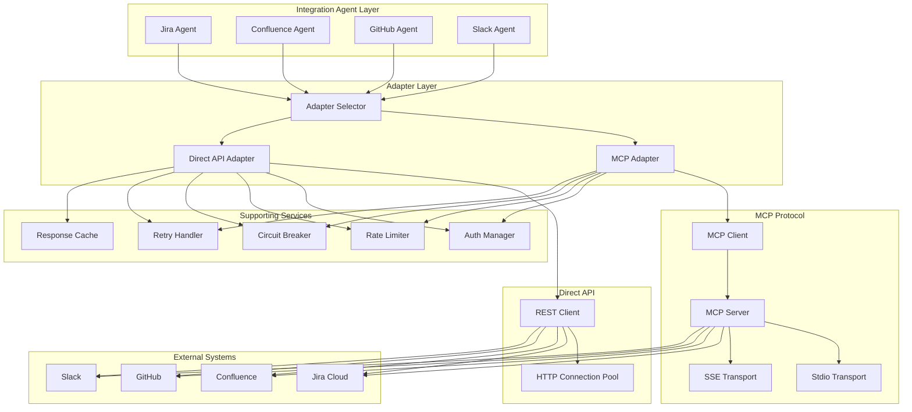
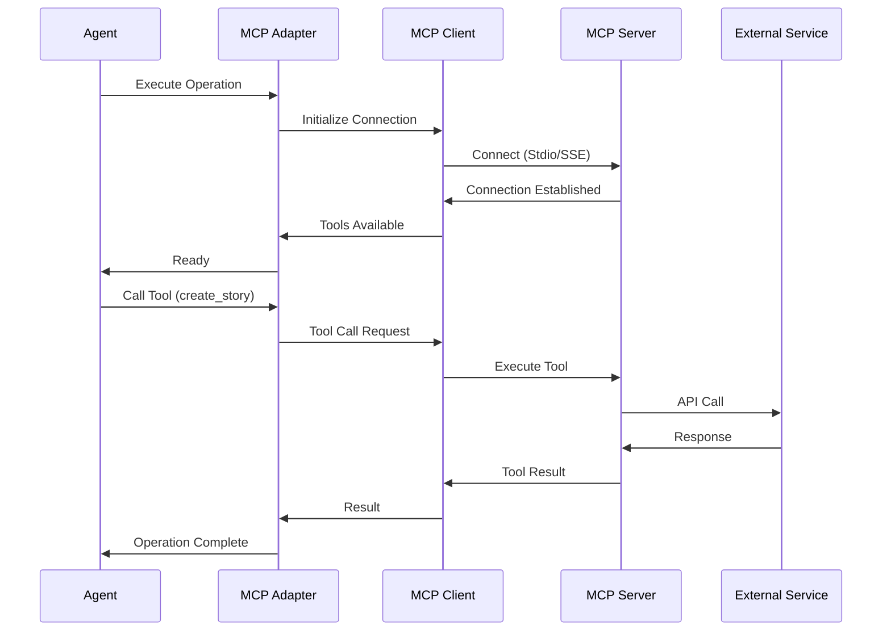
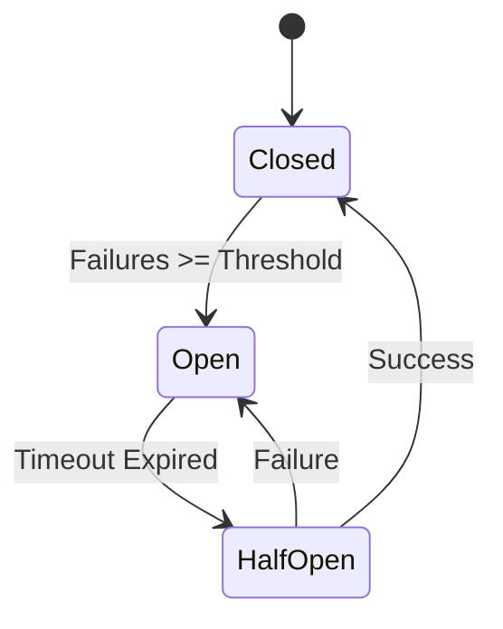

# ADR-005: Architecture Pattern for Integration Agents

## Status
Accepted

## Context
FuturisticPM integrates with external systems via 4 integration agents:
1. **Jira Agent**: Epic, story, sprint, release management
2. **Confluence Agent**: Page creation, documentation publishing
3. **GitHub Agent**: Repository, issue, PR management
4. **Slack Agent**: Team communication, notifications

These agents:
- Use MCP (Model Context Protocol) as primary integration method
- Fall back to direct APIs when MCP unavailable
- Handle OAuth 2.0 authentication
- Manage API rate limits
- Require connection pooling
- Need retry logic for transient failures

## Problem Statement
Design architecture pattern for integration agents that:
1. Supports MCP protocol and direct API fallbacks
2. Handles authentication (OAuth 2.0, API tokens)
3. Manages rate limits and quotas
4. Provides connection pooling
5. Implements retry logic
6. Enables async operations

## Decision
Adopt **Adapter Pattern with Circuit Breaker**:
- **MCP Adapter**: Handles MCP protocol connections
- **Direct API Adapter**: Fallback to direct REST APIs
- **Auth Manager**: Manages OAuth tokens and API keys
- **Rate Limiter**: Enforces rate limits per service
- **Circuit Breaker**: Prevents cascading failures
- **Connection Pool**: Manages HTTP connections

## Architecture Diagram



## Solution Options

### Option 1: Adapter Pattern with Circuit Breaker (Selected)
**Pros:**
- Supports multiple integration methods
- Automatic fallback mechanism
- Resilient to failures
- Rate limit protection
- Connection reuse

**Cons:**
- Increased complexity
- Multiple code paths to maintain

### Option 2: MCP-Only Pattern
**Pros:**
- Single integration method
- Standardized protocol
- Simpler architecture

**Cons:**
- No fallback if MCP unavailable
- Limited to MCP-supported services
- Vendor dependency

### Option 3: Direct API-Only Pattern
**Pros:**
- Full control
- No protocol dependency
- Direct integration

**Cons:**
- No MCP benefits
- More code per service
- Manual rate limiting

## Agent-Specific Architecture

### Jira Agent
```python
class JiraAgent:
    def __init__(self):
        self.mcp_adapter = MCPAdapter('atlassian')
        self.api_adapter = JiraAPIAdapter()
        self.auth_manager = AuthManager('jira')
        self.rate_limiter = RateLimiter(100, 60)  # 100 req/min
        self.circuit_breaker = CircuitBreaker(threshold=5)
    
    async def create_story(self, story_data: Dict) -> Dict:
        adapter = await self._select_adapter()
        
        try:
            with self.circuit_breaker:
                await self.rate_limiter.acquire()
                token = await self.auth_manager.get_token()
                
                if adapter == 'mcp':
                    result = await self.mcp_adapter.create_issue(token, story_data)
                else:
                    result = await self.api_adapter.create_issue(token, story_data)
                
                return result
        except RateLimitError:
            await asyncio.sleep(60)
            return await self.create_story(story_data)
        except CircuitBreakerOpen:
            raise ServiceUnavailableError("Jira service temporarily unavailable")
```

### Confluence Agent
- Similar pattern to Jira Agent
- MCP adapter for Atlassian MCP server
- Direct API adapter for Confluence REST API
- Rate limit: 50 req/min

### GitHub Agent
- MCP adapter for GitHub MCP server
- Direct API adapter for GitHub REST API
- Rate limit: 5000 req/hour (authenticated)
- OAuth token management

### Slack Agent
- MCP adapter for Slack MCP server
- Direct API adapter for Slack Web API
- Rate limit: 1 req/second (Tier 3)
- Bot token management

## Functional Requirements

### Jira Agent
- **FR-1**: Create epics, stories, releases
- **FR-2**: Create and manage sprints
- **FR-3**: Update issue status
- **FR-4**: Add comments to issues
- **FR-5**: Search and query issues

### Confluence Agent
- **FR-1**: Create and update pages
- **FR-2**: Create nested page structures
- **FR-3**: Add comments to pages
- **FR-4**: Search pages
- **FR-5**: Manage page permissions

### GitHub Agent
- **FR-1**: Manage repositories
- **FR-2**: Create and update issues
- **FR-3**: Manage pull requests
- **FR-4**: Track commits
- **FR-5**: Code search and analysis

### Slack Agent
- **FR-1**: Send channel messages
- **FR-2**: Send direct messages
- **FR-3**: List channels
- **FR-4**: Get user information
- **FR-5**: Manage notifications

## Non-Functional Requirements
- **NFR-1**: Response time < 2 seconds
- **NFR-2**: 99.9% availability
- **NFR-3**: Automatic retry (3 attempts with exponential backoff)
- **NFR-4**: Rate limit compliance
- **NFR-5**: Circuit breaker (open after 5 failures)
- **NFR-6**: Connection pooling (max 10 connections per service)
- **NFR-7**: Token refresh (before expiration)
- **NFR-8**: Async operation support

## MCP Integration Pattern



## Circuit Breaker States



## Rate Limiting Strategy

| Service | Rate Limit | Strategy |
|---------|------------|----------|
| Jira | 100 req/min | Token bucket |
| Confluence | 50 req/min | Token bucket |
| GitHub | 5000 req/hour | Leaky bucket |
| Slack | 1 req/second | Fixed window |

## Consequences

### Positive
- Resilient to external service failures
- Automatic fallback mechanism
- Rate limit protection
- Connection reuse (performance)
- Circuit breaker prevents cascading failures
- Supports both MCP and direct APIs

### Negative
- Increased complexity
- Multiple code paths
- Requires adapter maintenance
- Circuit breaker adds latency
- Rate limiting may delay operations

## Implementation Notes
- Use **MCP Python SDK** for MCP protocol
- Use **httpx** for async HTTP client
- Implement **tenacity** for retry logic
- Use **circuitbreaker** library for circuit breaker
- Implement **token bucket** algorithm for rate limiting
- Use **Redis** for distributed rate limiting
- Store OAuth tokens in **secure vault** (AWS Secrets Manager, HashiCorp Vault)
- Implement **token refresh** before expiration (5 min buffer)
- Use **connection pooling** (max 10 connections per service)
- Implement **request timeout** (10 seconds)

