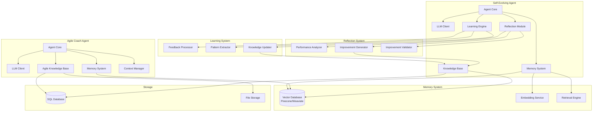
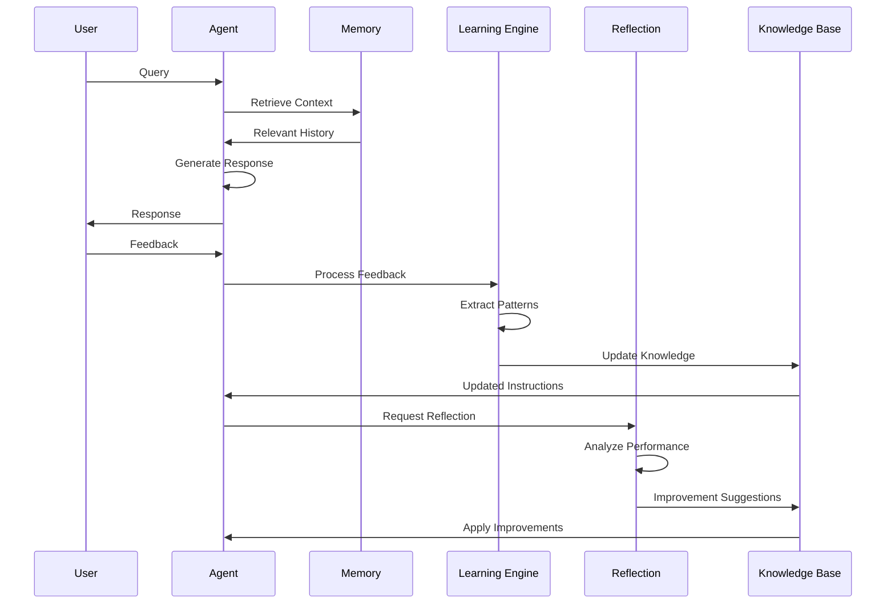
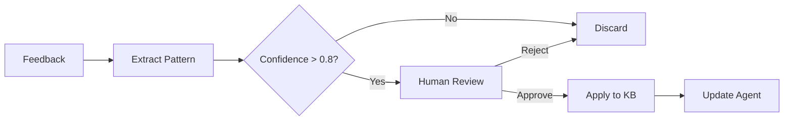

# ADR-006: Architecture Pattern for Specialized Agents

## Status
Accepted

## Context
FuturisticPM includes 2 specialized agents:
1. **Self-Evolving Agent**: Learns and improves from interactions
2. **Agile Coach Agent**: Provides agile methodology guidance

These agents:
- Require long-term memory
- Need learning capabilities
- Process feedback loops
- Maintain conversation history
- Support reflection and adaptation
- Handle specialized domain knowledge

## Problem Statement
Design architecture pattern for specialized agents that:
1. Supports learning and adaptation
2. Maintains long-term memory
3. Processes feedback loops
4. Enables reflection mechanisms
5. Handles specialized knowledge bases
6. Supports continuous improvement

## Decision
Adopt **Learning Agent Pattern with Memory System**:
- **Agent Core**: LLM-based agent with specialized instructions
- **Memory System**: Vector database for semantic search
- **Learning Engine**: Processes feedback and updates knowledge
- **Reflection Module**: Analyzes performance and suggests improvements
- **Knowledge Base**: Stores learned patterns and best practices
- **Feedback Loop**: Captures and processes user feedback

## Architecture Diagram



## Solution Options

### Option 1: Learning Agent Pattern with Memory System (Selected)
**Pros:**
- Supports continuous learning
- Long-term memory retention
- Feedback processing
- Reflection capabilities
- Knowledge accumulation

**Cons:**
- Complex memory management
- Requires vector database
- Learning validation needed

### Option 2: Stateless Agent Pattern
**Pros:**
- Simple architecture
- No memory management
- Fast responses

**Cons:**
- No learning capability
- No memory retention
- No adaptation

### Option 3: Rule-Based Learning
**Pros:**
- Explicit rules
- Predictable behavior
- Easy to debug

**Cons:**
- Limited learning
- Manual rule updates
- Not adaptive

## Self-Evolving Agent Architecture

### Components

#### 1. Agent Core
- LLM-based agent with specialized instructions
- Processes user queries
- Generates responses
- Captures feedback

#### 2. Memory System
- Vector database for semantic search
- Stores conversation history
- Retrieves relevant past interactions
- Maintains context across sessions

#### 3. Learning Engine
```python
class LearningEngine:
    async def process_feedback(self, feedback: Feedback):
        # Extract patterns
        patterns = await self.pattern_extractor.extract(feedback)
        
        # Update knowledge base
        for pattern in patterns:
            if pattern.confidence > 0.8:
                await self.knowledge_updater.add(pattern)
        
        # Update agent instructions
        await self.update_agent_instructions()
```

#### 4. Reflection Module
- Analyzes agent performance
- Identifies improvement areas
- Generates improvement suggestions
- Validates improvements before applying

### Learning Flow



## Agile Coach Agent Architecture

### Components

#### 1. Agent Core
- Specialized in agile methodologies
- Provides coaching and guidance
- Answers agile-related questions
- Suggests best practices

#### 2. Agile Knowledge Base
- Scrum framework knowledge
- Kanban practices
- SAFe methodology
- Agile metrics and KPIs
- Retrospective techniques
- Sprint planning templates

#### 3. Context Manager
- Maintains conversation context
- Tracks team context
- Remembers previous advice
- Personalizes responses

### Knowledge Base Structure

```json
{
  "frameworks": {
    "scrum": {
      "ceremonies": ["sprint_planning", "daily_standup", "sprint_review", "retrospective"],
      "artifacts": ["product_backlog", "sprint_backlog", "increment"],
      "roles": ["product_owner", "scrum_master", "development_team"]
    },
    "kanban": {
      "principles": ["visualize", "limit_wip", "manage_flow"],
      "practices": ["kanban_board", "wip_limits", "flow_metrics"]
    }
  },
  "templates": {
    "user_story": "As a {role}, I want {action}, so that {benefit}",
    "sprint_goal": "Template for defining sprint goals",
    "retrospective": "Template for conducting retrospectives"
  }
}
```

## Functional Requirements

### Self-Evolving Agent
- **FR-1**: Learn from user feedback
- **FR-2**: Extract patterns from interactions
- **FR-3**: Update knowledge base
- **FR-4**: Reflect on performance
- **FR-5**: Suggest improvements
- **FR-6**: Maintain conversation history
- **FR-7**: Retrieve relevant past interactions

### Agile Coach Agent
- **FR-1**: Provide agile methodology guidance
- **FR-2**: Answer Scrum/Kanban questions
- **FR-3**: Suggest best practices
- **FR-4**: Provide templates and examples
- **FR-5**: Track team context
- **FR-6**: Personalize advice
- **FR-7**: Conduct virtual retrospectives

## Non-Functional Requirements
- **NFR-1**: Memory retrieval < 500ms
- **NFR-2**: Support 10,000+ stored interactions
- **NFR-3**: Learning validation before application
- **NFR-4**: Reflection cycle every 100 interactions
- **NFR-5**: Knowledge base versioning
- **NFR-6**: Feedback processing < 2 seconds
- **NFR-7**: Vector database scalability

## Memory System Architecture

### Vector Database Schema
```python
{
    "id": "interaction_123",
    "embedding": [0.1, 0.2, ...],  # 1536 dimensions
    "metadata": {
        "user_id": "user_456",
        "timestamp": "2025-11-15T10:00:00Z",
        "agent": "self_evolving",
        "query": "How to improve product strategy?",
        "response": "Based on past interactions...",
        "feedback": "helpful",
        "tags": ["strategy", "improvement"]
    }
}
```

### Retrieval Strategy
- Semantic similarity search
- Filter by user_id, agent, tags
- Recency weighting
- Top-K retrieval (K=10)

## Learning Validation



## Consequences

### Positive
- Continuous improvement capability
- Long-term memory retention
- Personalized responses
- Knowledge accumulation
- Adaptive behavior
- Reflection and self-improvement

### Negative
- Complex memory management
- Requires vector database infrastructure
- Learning validation overhead
- Potential for incorrect learning
- Higher resource requirements

## Implementation Notes
- Use **Pinecone** or **Weaviate** for vector database
- Use **OpenAI embeddings** (text-embedding-3-large)
- Implement **RAG pattern** for knowledge retrieval
- Use **LangChain** for memory management
- Store feedback in **PostgreSQL** with JSONB
- Implement **confidence threshold** (0.8) for learning
- Use **human-in-the-loop** for critical learning updates
- Implement **knowledge base versioning**
- Use **semantic caching** for common queries
- Implement **feedback aggregation** (batch processing)

