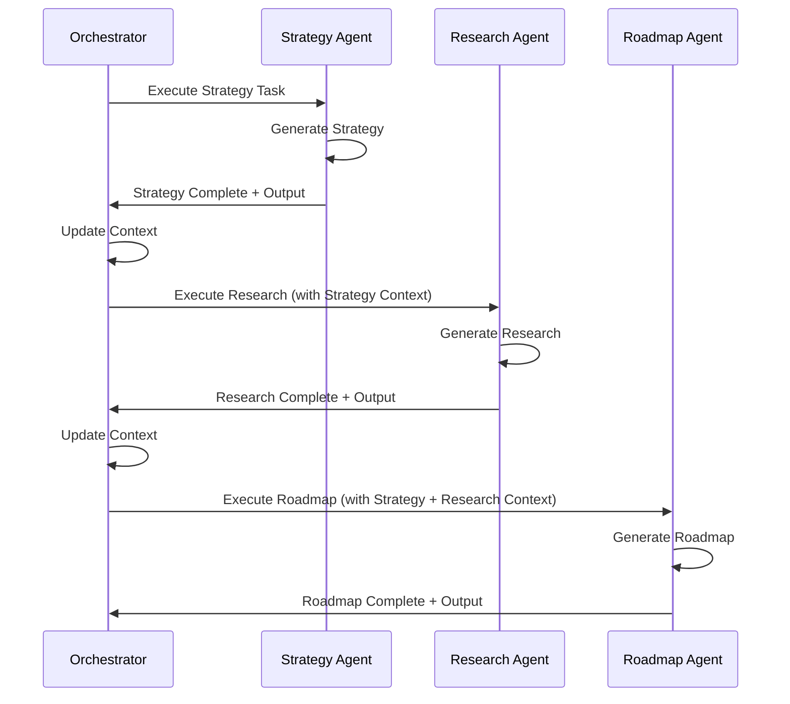
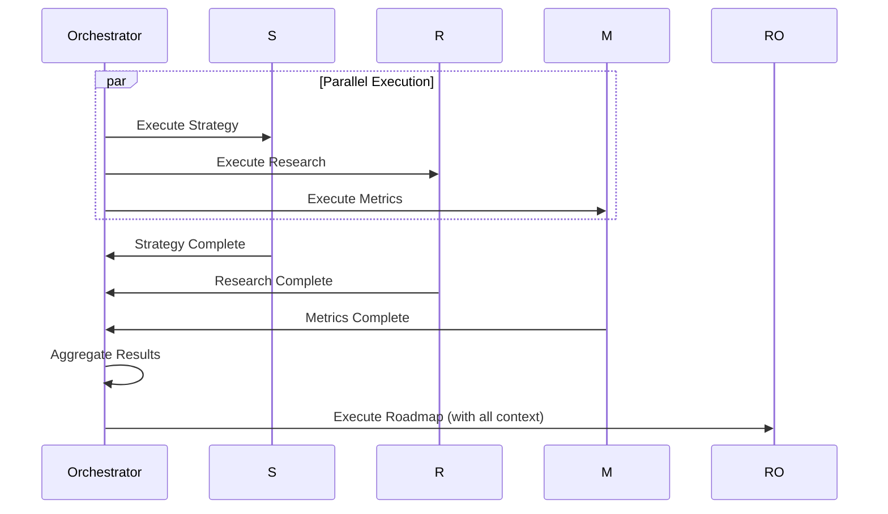
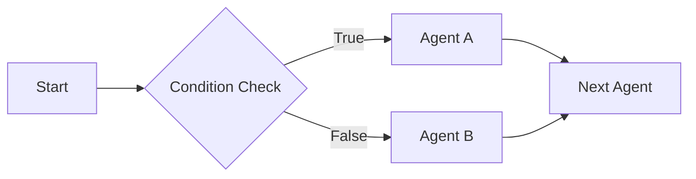
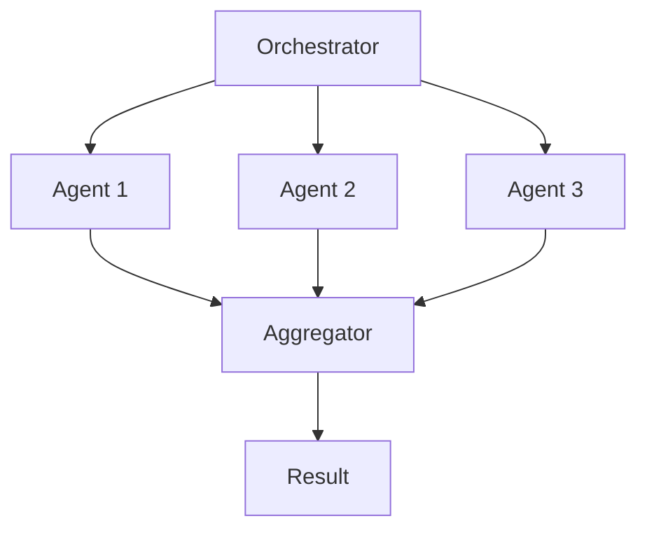

# ADR-007: Agent-to-Agent Interaction Pattern

## Status
Accepted

## Context
FuturisticPM orchestrates 10+ agents that must:
- Coordinate sequential workflows (Strategy → Research → Roadmap → ...)
- Support parallel execution when possible
- Share context and state between agents
- Handle agent failures gracefully
- Enable dynamic agent selection
- Support both synchronous and asynchronous interactions
- Maintain audit trails of all interactions

## Problem Statement
Design agent-to-agent interaction pattern that:
1. Supports sequential and parallel execution
2. Enables context sharing between agents
3. Handles agent failures and retries
4. Provides dynamic agent routing
5. Maintains interaction history
6. Supports both sync and async patterns
7. Enables agent discovery and capability matching

## Decision
Adopt **Orchestrator Pattern with Event-Driven Communication**:
- **Agent Orchestrator**: Central coordination service
- **Coordination Rules Engine**: Defines agent interaction patterns
- **Event Bus**: Asynchronous message passing (Redis Streams)
- **Context Manager**: Aggregates and shares context
- **Agent Registry**: Service discovery and capability matching
- **Interaction Logger**: Audit trail of all interactions

## Architecture Diagram

```mermaid
graph TB
    subgraph "Orchestration Layer"
        ORCH[Agent Orchestrator]
        RULES[Coordination Rules Engine]
        ROUTER[Agent Router]
        CONTEXT_MGR[Context Manager]
    end
    
    subgraph "Communication Layer"
        EVENT_BUS[Event Bus<br/>Redis Streams]
        MSG_QUEUE[Message Queue]
        SYNC_HANDLER[Sync Handler]
        ASYNC_HANDLER[Async Handler]
    end
    
    subgraph "Agent Registry"
        REGISTRY[Service Registry]
        CAPABILITIES[Capability Index]
        HEALTH[Health Monitor]
    end
    
    subgraph "Core PM Agents"
        STRAT[Strategy Agent]
        RESEARCH[Research Agent]
        ROADMAP[Roadmap Agent]
        METRICS[Metrics Agent]
        STAKE[Stakeholder Agent]
        EXEC[Execution Agent]
    end
    
    subgraph "Integration Agents"
        JIRA[Jira Agent]
        CONFLUENCE[Confluence Agent]
        GITHUB[GitHub Agent]
        SLACK[Slack Agent]
    end
    
    subgraph "Specialized Agents"
        EVOLVE[Self-Evolving Agent]
        AGILE[Agile Coach Agent]
    end
    
    subgraph "Supporting Services"
        LOGGER[Interaction Logger]
        RETRY[Retry Handler]
        CIRCUIT[Circuit Breaker]
    end
    
    ORCH --> RULES
    ORCH --> ROUTER
    ORCH --> CONTEXT_MGR
    
    ROUTER --> REGISTRY
    REGISTRY --> CAPABILITIES
    REGISTRY --> HEALTH
    
    ORCH --> EVENT_BUS
    ORCH --> MSG_QUEUE
    ORCH --> SYNC_HANDLER
    ORCH --> ASYNC_HANDLER
    
    EVENT_BUS --> STRAT
    EVENT_BUS --> RESEARCH
    EVENT_BUS --> ROADMAP
    EVENT_BUS --> METRICS
    EVENT_BUS --> STAKE
    EVENT_BUS --> EXEC
    EVENT_BUS --> JIRA
    EVENT_BUS --> CONFLUENCE
    EVENT_BUS --> GITHUB
    EVENT_BUS --> SLACK
    EVENT_BUS --> EVOLVE
    EVENT_BUS --> AGILE
    
    STRAT --> RETRY
    RESEARCH --> RETRY
    ROADMAP --> RETRY
    METRICS --> RETRY
    STAKE --> RETRY
    EXEC --> RETRY
    
    JIRA --> CIRCUIT
    CONFLUENCE --> CIRCUIT
    GITHUB --> CIRCUIT
    SLACK --> CIRCUIT
    
    ORCH --> LOGGER
    STRAT --> LOGGER
    RESEARCH --> LOGGER
    ROADMAP --> LOGGER
```



## Solution Options

### Option 1: Orchestrator Pattern with Event Bus (Selected)
**Pros:**
- Centralized coordination
- Loose coupling between agents
- Supports both sync and async
- Scalable and resilient
- Clear interaction patterns
- Easy to add new agents

**Cons:**
- Single point of failure (orchestrator)
- Event ordering complexity
- Requires event bus infrastructure

### Option 2: Direct Agent-to-Agent Communication
**Pros:**
- No central orchestrator
- Direct communication
- Lower latency

**Cons:**
- Tight coupling
- Difficult to manage
- No centralized coordination
- Complex failure handling

### Option 3: Publish-Subscribe Only
**Pros:**
- Fully decoupled
- Highly scalable
- Event-driven

**Cons:**
- No coordination
- Difficult sequential workflows
- Event ordering issues
- Complex debugging

## Interaction Patterns

### 1. Sequential Pattern


### 2. Parallel Pattern


### 3. Conditional Pattern


### 4. Fan-Out Pattern


## Coordination Rules

### Rule Definition
```python
class CoordinationRule:
    def __init__(self, trigger_agent: str, target_agent: str, 
                 condition: Callable = None, pattern: str = "sequential"):
        self.trigger_agent = trigger_agent
        self.target_agent = target_agent
        self.condition = condition  # Optional condition function
        self.pattern = pattern  # sequential, parallel, conditional
```

### Example Rules
```python
# Sequential: Strategy → Research
rule1 = CoordinationRule(
    trigger_agent="strategy",
    target_agent="research",
    pattern="sequential"
)

# Conditional: If research finds competitors, trigger competitive analysis
rule2 = CoordinationRule(
    trigger_agent="research",
    target_agent="competitive_analysis",
    condition=lambda result, context: "competitor" in result.lower(),
    pattern="conditional"
)

# Parallel: Execute metrics and stakeholder in parallel
rule3 = CoordinationRule(
    trigger_agent="roadmap",
    target_agent="metrics",
    pattern="parallel"
)
rule4 = CoordinationRule(
    trigger_agent="roadmap",
    target_agent="stakeholder",
    pattern="parallel"
)
```

## Communication Mechanisms

### 1. Synchronous (Request-Response)
```python
async def sync_interaction(source_agent: str, target_agent: str, 
                          message: str, context: Dict) -> Dict:
    """Synchronous agent interaction"""
    response = await agent_registry.get_agent(target_agent).execute(
        message=message,
        context=context,
        source_agent=source_agent
    )
    return response
```

### 2. Asynchronous (Event-Driven)
```python
async def async_interaction(source_agent: str, target_agent: str,
                           message: str, context: Dict):
    """Asynchronous agent interaction via event bus"""
    event = {
        "id": str(uuid.uuid4()),
        "source": source_agent,
        "target": target_agent,
        "message": message,
        "context": context,
        "timestamp": datetime.utcnow().isoformat()
    }
    await event_bus.publish(f"agent.{target_agent}", event)
```

### 3. Broadcast (Pub-Sub)
```python
async def broadcast(message: str, context: Dict, 
                   capability_filter: List[str] = None):
    """Broadcast message to multiple agents"""
    agents = await agent_registry.find_by_capabilities(capability_filter)
    for agent in agents:
        await event_bus.publish(f"agent.{agent.name}", {
            "message": message,
            "context": context,
            "broadcast": True
        })
```

## Context Sharing

### Context Structure
```python
{
    "workflow_id": "wf_123",
    "user_id": "user_456",
    "tenant_id": "tenant_789",
    "step": "research",
    "previous_outputs": {
        "strategy": {
            "agent": "strategy",
            "output": "...",
            "timestamp": "2025-11-15T10:00:00Z"
        }
    },
    "metadata": {
        "product_name": "FuturisticPM",
        "industry": "SaaS"
    }
}
```

### Context Aggregation
```python
class ContextManager:
    async def aggregate_context(self, workflow_id: str, 
                               current_step: str) -> Dict:
        """Aggregate context from all previous steps"""
        previous_outputs = await self.db.get_previous_outputs(workflow_id)
        
        context = {
            "workflow_id": workflow_id,
            "current_step": current_step,
            "previous_outputs": previous_outputs,
            "summary": await self.summarize_outputs(previous_outputs)
        }
        
        return context
```

## Functional Requirements
- **FR-1**: Support sequential agent execution
- **FR-2**: Support parallel agent execution
- **FR-3**: Support conditional agent routing
- **FR-4**: Enable context sharing between agents
- **FR-5**: Handle agent failures gracefully
- **FR-6**: Support dynamic agent discovery
- **FR-7**: Maintain interaction history
- **FR-8**: Support both sync and async patterns

## Non-Functional Requirements
- **NFR-1**: Interaction latency < 100ms (orchestrator overhead)
- **NFR-2**: Support 1000+ concurrent workflows
- **NFR-3**: 99.9% orchestrator availability
- **NFR-4**: Automatic retry on agent failure (3 attempts)
- **NFR-5**: Context size limit (100KB per workflow)
- **NFR-6**: Event ordering guarantee (per workflow)
- **NFR-7**: Complete audit logging
- **NFR-8**: Agent health monitoring

## Failure Handling

### Retry Strategy
```python
class RetryHandler:
    async def execute_with_retry(self, agent: str, task: str, 
                                max_retries: int = 3) -> Dict:
        for attempt in range(max_retries):
            try:
                result = await self.execute_agent(agent, task)
                return result
            except AgentTimeoutError:
                if attempt < max_retries - 1:
                    await asyncio.sleep(2 ** attempt)  # Exponential backoff
                    continue
                raise
            except AgentError as e:
                if e.retryable and attempt < max_retries - 1:
                    await asyncio.sleep(2 ** attempt)
                    continue
                raise
```

### Circuit Breaker
```python
class AgentCircuitBreaker:
    def __init__(self, failure_threshold: int = 5, 
                 recovery_timeout: int = 60):
        self.failure_threshold = failure_threshold
        self.recovery_timeout = recovery_timeout
        self.failures = 0
        self.state = "closed"  # closed, open, half_open
    
    async def call(self, agent: str, task: str) -> Dict:
        if self.state == "open":
            if time.time() - self.last_failure > self.recovery_timeout:
                self.state = "half_open"
            else:
                raise CircuitBreakerOpenError()
        
        try:
            result = await self.execute_agent(agent, task)
            if self.state == "half_open":
                self.state = "closed"
                self.failures = 0
            return result
        except Exception as e:
            self.failures += 1
            if self.failures >= self.failure_threshold:
                self.state = "open"
                self.last_failure = time.time()
            raise
```

## Agent Registry

### Service Discovery
```python
class AgentRegistry:
    async def register_agent(self, agent: Agent, capabilities: List[str]):
        """Register agent with capabilities"""
        await self.registry.add({
            "name": agent.name,
            "capabilities": capabilities,
            "endpoint": agent.endpoint,
            "health": await agent.health_check(),
            "registered_at": datetime.utcnow()
        })
    
    async def find_agent(self, capability: str) -> Agent:
        """Find agent by capability"""
        agents = await self.registry.find_by_capability(capability)
        # Select healthy agent with lowest load
        return self.select_best_agent(agents)
```

## Consequences

### Positive
- Centralized coordination simplifies management
- Event-driven architecture enables scalability
- Loose coupling allows independent agent evolution
- Clear interaction patterns
- Supports complex workflows
- Resilient to agent failures
- Complete audit trail

### Negative
- Orchestrator is single point of failure (mitigate with HA)
- Event ordering complexity
- Requires event bus infrastructure
- Additional latency (orchestrator overhead)
- Complex debugging across agents

## Implementation Notes
- Use **Redis Streams** for event bus (ordered, persistent)
- Implement **Kubernetes Service Discovery** for agent registry
- Use **gRPC** for synchronous agent calls (low latency)
- Implement **idempotency keys** for retries
- Use **distributed tracing** (Jaeger/Zipkin) for debugging
- Implement **workflow state machine** for complex flows
- Use **message deduplication** (Redis SET with TTL)
- Implement **backpressure** handling (queue size limits)
- Use **health checks** (every 30 seconds)
- Implement **graceful degradation** (fallback agents)

